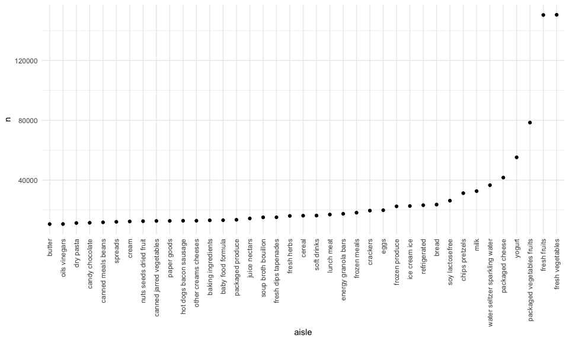
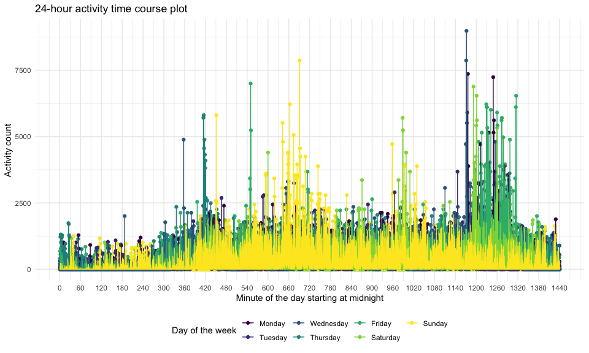
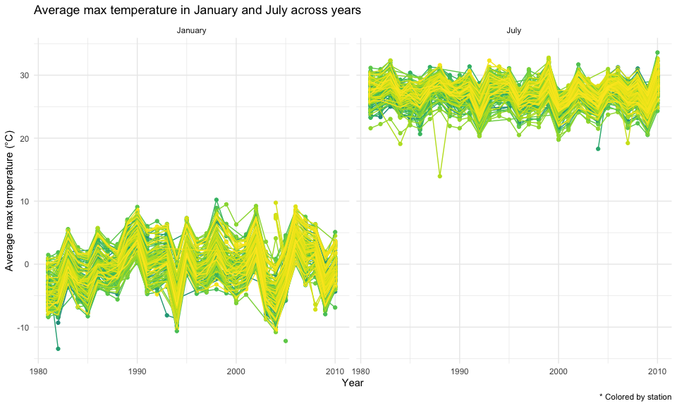

HW3
================
Yi Sun

Solution to HW3.

## Problem 1

Load the Instacart data.

``` r
data("instacart")
```

The Instacart dataset contains 1384617 rows and 15 columns.

Each observation in this dataset is a product from an order submitted by
a user.

In this dataset, there are variables about the user and order like user
ID, order ID, order day, order hour, days since the last order, etc.,
and also variables about the product like product ID, product name,
aisle, department, etc.

For example, one observation in the dataset tells us a product like
Bulgarian Yogurt was bought in which order by which user (with IDs), on
which day of the week, and which aisle and department this product
belongs to, etc.

How many aisles are there, and which aisles are the most items ordered
from?

``` r
instacart %>% 
    count(aisle) %>% 
    arrange(desc(n))
```

    ## # A tibble: 134 x 2
    ##    aisle                              n
    ##    <chr>                          <int>
    ##  1 fresh vegetables              150609
    ##  2 fresh fruits                  150473
    ##  3 packaged vegetables fruits     78493
    ##  4 yogurt                         55240
    ##  5 packaged cheese                41699
    ##  6 water seltzer sparkling water  36617
    ##  7 milk                           32644
    ##  8 chips pretzels                 31269
    ##  9 soy lactosefree                26240
    ## 10 bread                          23635
    ## # … with 124 more rows

There are 134 aisles, and the most items are ordered from the aisle
“fresh vegetables”.

Make a plot that shows the number of items ordered in each aisle,
limiting this to aisles with more than 10000 items ordered. Arrange
aisles sensibly, and organize the plot.

``` r
instacart %>% 
    count(aisle) %>% 
    filter(n > 10000) %>% 
    mutate(
        aisle = factor(aisle),
        aisle = fct_reorder(aisle, n)
    ) %>% 
    ggplot(aes(x = aisle, y = n)) + 
    geom_point() + 
    theme(axis.text.x = element_text(angle = 90, vjust = 0.5, hjust = 1))
```



The top 2 aisles are “fresh fruits” and “fresh vegetables”.

Make a table showing the three most popular items in each of the aisles
“baking ingredients”, “dog food care”, and “packaged vegetables
fruits”. Include the number of times each item is ordered in the
table.

``` r
instacart %>% 
  filter(aisle %in% c("baking ingredients", "dog food care", "packaged vegetables fruits")) %>% 
  group_by(aisle) %>% 
  count(product_name) %>% 
  mutate(rank = min_rank(desc(n))) %>% 
  filter(rank < 4) %>% 
  arrange(aisle, rank) %>% 
  knitr::kable()
```

| aisle                      | product\_name                                 |    n | rank |
| :------------------------- | :-------------------------------------------- | ---: | ---: |
| baking ingredients         | Light Brown Sugar                             |  499 |    1 |
| baking ingredients         | Pure Baking Soda                              |  387 |    2 |
| baking ingredients         | Cane Sugar                                    |  336 |    3 |
| dog food care              | Snack Sticks Chicken & Rice Recipe Dog Treats |   30 |    1 |
| dog food care              | Organix Chicken & Brown Rice Recipe           |   28 |    2 |
| dog food care              | Small Dog Biscuits                            |   26 |    3 |
| packaged vegetables fruits | Organic Baby Spinach                          | 9784 |    1 |
| packaged vegetables fruits | Organic Raspberries                           | 5546 |    2 |
| packaged vegetables fruits | Organic Blueberries                           | 4966 |    3 |

The top 3 items in aisle “baking ingredients” are “Light Brown Sugar”,
“Pure Baking Soda”, and “Cane Sugar”.

The top 3 items in aisle “dog food care” are “Snack Sticks Chicken &
Rice Recipe Dog Treats”, “Organix Chicken & Brown Rice Recipe”, and
“Small Dog Biscuits”.

The top 3 items in aisle “packaged vegetables fruits” are “Organic Baby
Spinach”, “Organic Raspberries”, and “Organic Blueberries”.

Make a table showing the mean hour of the day at which Pink Lady Apples
and Coffee Ice Cream are ordered on each day of the week; format the
table as a 2 x 7 table.

``` r
instacart %>% 
  filter(product_name %in% c("Pink Lady Apples", "Coffee Ice Cream")) %>% 
  group_by(product_name, order_dow) %>% 
  summarize(mean_hour = mean(order_hour_of_day)) %>% 
  pivot_wider(
    names_from = order_dow,
    values_from = mean_hour
  )
```

    ## `summarise()` regrouping output by 'product_name' (override with `.groups` argument)

    ## # A tibble: 2 x 8
    ## # Groups:   product_name [2]
    ##   product_name       `0`   `1`   `2`   `3`   `4`   `5`   `6`
    ##   <chr>            <dbl> <dbl> <dbl> <dbl> <dbl> <dbl> <dbl>
    ## 1 Coffee Ice Cream  13.8  14.3  15.4  15.3  15.2  12.3  13.8
    ## 2 Pink Lady Apples  13.4  11.4  11.7  14.2  11.6  12.8  11.9

The mean hour of the day at which Pink Lady Apples are ordered is
generally earlier than that at which Coffee Ice Cream are ordered on
each day of the week except on Fridays.

## Problem 2

Load, tidy, and otherwise wrangle the accel\_data.

``` r
accel_df = read_csv(file = "./accel_data.csv") %>% 
  janitor::clean_names() %>% 
  pivot_longer(
    activity_1:activity_1440,
    names_to = "minute",
    names_prefix = "activity_",
    values_to = "activity_count"
  ) %>% 
  mutate_at(vars(week, day_id, minute), as.integer) %>% 
  mutate(day = as.factor(day)) %>% 
  mutate(weekday_vs_weekend = as.factor(
    ifelse(day %in% c("Monday", "Tuesday", "Wednesday", "Thursday", "Friday"), "Weekday", "Weekend")
  ))
```

    ## Parsed with column specification:
    ## cols(
    ##   .default = col_double(),
    ##   day = col_character()
    ## )

    ## See spec(...) for full column specifications.

The resulting dataset `accel_df` include 50400 observations and 6
variables.

The variables in this dataset are factor variables `day` indicating the
day of the week, and `weekday_vs_weekend` indicating whether the day is
weekday or weekend, and numeric variables `week` identifying the week,
`day_id` identifying the day, `minute` identifying the minute of the
24-hour day starting at midnight, and `activity_count` indicating the
activity count for each minute.

Using the tidied dataset, aggregate across minutes to create a total
activity variable for each day, and create a table showing these totals.

``` r
daily_activity_table =   
  accel_df %>% 
  group_by(week, day) %>% 
  summarize(total_activity_day = sum(activity_count)) %>% 
  pivot_wider(
    names_from = day,
    values_from = total_activity_day
  ) %>% 
  relocate("week", "Monday", "Tuesday", "Wednesday", "Thursday", "Friday", "Saturday", "Sunday") %>% 
  knitr::kable()
```

    ## `summarise()` regrouping output by 'week' (override with `.groups` argument)

``` r
daily_activity_table
```

| week |    Monday |  Tuesday | Wednesday | Thursday |   Friday | Saturday | Sunday |
| ---: | --------: | -------: | --------: | -------: | -------: | -------: | -----: |
|    1 |  78828.07 | 307094.2 |    340115 | 355923.6 | 480542.6 |   376254 | 631105 |
|    2 | 295431.00 | 423245.0 |    440962 | 474048.0 | 568839.0 |   607175 | 422018 |
|    3 | 685910.00 | 381507.0 |    468869 | 371230.0 | 467420.0 |   382928 | 467052 |
|    4 | 409450.00 | 319568.0 |    434460 | 340291.0 | 154049.0 |     1440 | 260617 |
|    5 | 389080.00 | 367824.0 |    445366 | 549658.0 | 620860.0 |     1440 | 138421 |

Based on the resulting table, we can see that the daily activity counts
for Tuesdays and Wednesdays are less variant, compared to the daily
activity counts for other days. This may indicate that the activity
level of the male on Tuesdays and Wednesdays is more stable than on
other days.

Make a single-panel plot that shows the 24-hour activity time courses
for each day and use color to indicate day of the week.

``` r
daily_activity_course_plot = 
  accel_df %>% 
  mutate(day = forcats::fct_relevel(day, c("Monday", "Tuesday", "Wednesday", "Thursday", "Friday", "Saturday", "Sunday"))) %>% 
  ggplot(aes(x = minute, y = activity_count, color = day)) + 
    geom_point() + 
    geom_line() +
    labs(
      title = "24-hour activity time course plot",
      x = "Minute of the day starting at midnight",
      y = "Activity count",
      color = "Day of the week"
    ) + 
    scale_x_continuous(breaks = seq(0, 1440, by = 60))

daily_activity_course_plot
```



Based on the resulting graph, we can see that the activity count is
generally higher from 360 to 690 minute (6:00 AM to 11:30 AM), from 960
to 1020 minute (4:00 PM to 5:00 PM) and from 1170 to 1320 minute (7:30
PM to 10:00PM), indicating the time ranges of a day when the male is
most active.

## Problem 3

Load the NY NOAA data and explore the missing values.

``` r
data("ny_noaa")

explore_na = 
  ny_noaa %>% 
  summarize_all(funs(sum(is.na(.)))) %>% 
  knitr::kable()
```

    ## Warning: `funs()` is deprecated as of dplyr 0.8.0.
    ## Please use a list of either functions or lambdas: 
    ## 
    ##   # Simple named list: 
    ##   list(mean = mean, median = median)
    ## 
    ##   # Auto named with `tibble::lst()`: 
    ##   tibble::lst(mean, median)
    ## 
    ##   # Using lambdas
    ##   list(~ mean(., trim = .2), ~ median(., na.rm = TRUE))
    ## This warning is displayed once every 8 hours.
    ## Call `lifecycle::last_warnings()` to see where this warning was generated.

``` r
explore_na
```

| id | date |   prcp |   snow |   snwd |    tmax |    tmin |
| -: | ---: | -----: | -----: | -----: | ------: | ------: |
|  0 |    0 | 145838 | 381221 | 591786 | 1134358 | 1134420 |

The NY NOAA dataset contains 2595176 rows and 7 columns.

Each observation in this dataset is a weather record from a weather
station on a date.

The variables in this dataset include `id` for the weather station ID,
`date` for the date of observation, and other variables about weather
details like `prcp` for the precipitation (tenths of mm), `snow` for the
snowfall (mm), `snwd` for the snow depth (mm), `tmax` for the maximum
temperature (tenths of degrees C), and `tmin` for the minimum
temperature (tenths of degrees C).

Missing data is a big issue in this dataset, since a large number of
weather observations have missing values for variables about weather
details, especially for maximum and minimum temperatures.

Do some data cleaning. Create separate variables for year, month, and
day. Ensure observations for temperature, precipitation, and snowfall
are given in reasonable units.

``` r
ny_noaa = 
  ny_noaa %>% 
  janitor::clean_names() %>% 
  separate(date, into = c("year", "month", "day"), convert = TRUE) %>% 
  mutate(prcp = prcp / 10, tmax = as.numeric(tmax) / 10, tmin = as.numeric(tmin) / 10)
```

For snowfall, the most commonly observed values are 0, because there is
no snow observed by most weather stations on most of days.

Make a two-panel plot showing the average max temperature in January and
in July in each station across years.

``` r
mean_tmax_jan_jul_plot = 
  ny_noaa %>% 
  filter(month %in% c(1, 7)) %>% 
  mutate(month = ifelse(month == 1, "January", "July")) %>% 
  group_by(id, year, month) %>% 
  summarize(mean_tmax = mean(tmax, na.rm = TRUE)) %>% 
  ggplot(aes(x = year, y = mean_tmax, color = id)) + 
    geom_point() + 
    geom_line() +
    facet_grid(~month) + 
    labs(
    title = "Average max temperature in January and July across years",
    x = "Year",
    y = "Average max temperature (°C)",
    caption = "* Colored by station"
    ) + 
    theme(legend.position = "none", panel.spacing = unit(0.5, "lines"))
```

    ## `summarise()` regrouping output by 'id', 'year' (override with `.groups` argument)

``` r
mean_tmax_jan_jul_plot
```

    ## Warning: Removed 5970 rows containing missing values (geom_point).

    ## Warning: Removed 5640 row(s) containing missing values (geom_path).



The average max temperature in January in each station across years
fluctuates around 0 degrees C, and the average max temperature in July
in each station across years fluctuates around 25 degrees C.

I think there is one outlier in each panel, which is apparently lower
than the majority of average max temperatures of the month January or
July in each station across years.

Make a two-panel plot including:

1)  tmax vs tmin for the full dataset

2)  the distribution of snowfall values greater than 0 and less than 100
    separately by year.

<!-- end list -->

``` r
tmax_vs_tmin_p = 
  ny_noaa %>% 
  ggplot(aes(x = tmin, y = tmax)) +
    geom_smooth(se = FALSE) +
    labs(
      title = "Maximum temperature vs minimum temperature",
      x = "Minimum temperature (°C)",
      y = "Maximum temperature (°C)"
    )

snow_by_year_p = 
  ny_noaa %>% 
  filter(snow > 0 & snow < 100) %>% 
  mutate(year = as.factor(year)) %>% 
  ggplot(aes(x = year, y = snow)) + 
    geom_violin(aes(fill = year), color = "blue", alpha = .5) +
    labs(
      title = "Snowfall (0 - 100 mm) distribution by year",
      x = "Year",
      y = "Snowfall (mm)"
    ) + 
    theme(axis.text.x = element_text(angle = 90), legend.position = "none")

tmax_vs_tmin_p / snow_by_year_p
```

    ## `geom_smooth()` using method = 'gam' and formula 'y ~ s(x, bs = "cs")'

    ## Warning: Removed 1136276 rows containing non-finite values (stat_smooth).


